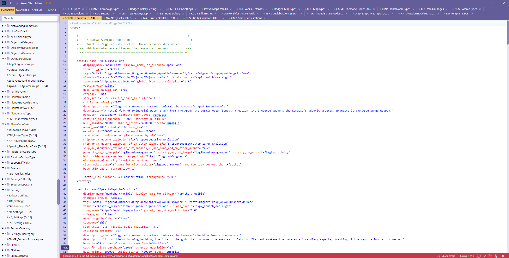
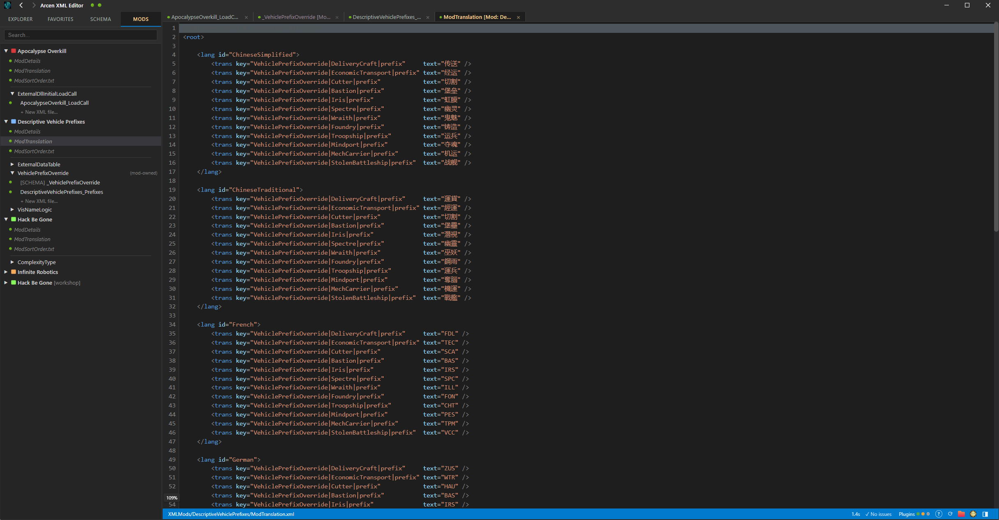

# AXE — Arcen XML Editor

A portable, schema-aware desktop editor for the XML game-data files used by
Arcen Games titles (currently **Heart of the Machine** and **AI War 2**),
including their DLC and mods. Built with Electron, React, and CodeMirror 6.

This project has been something I've wanted to create for a long time, but it
was always a bit out of reach. This is something that mimics the feel of
Visual Studio as an xml editor, but with intellisense rather than just flat
editing. It also includes really robust validation, as well as the ability
to quickly find "foreign key" entries when you're typing, versus having to look
them up. It also includes field-aware spellcheck, and the ability to link to an
LLM to do grammar-checking.

In general, this has a mode where you can use it for small isolated projects
that are unrelated to Arcen. Or it has the DLC-and-mods-aware mode that is specific
to the Arcen structure. HotM starts a much newer format for the mods and xml in general,
while AI War 2 is more legacy; but both are fully supported by the tool

## Screenshots

Light mode:



Dark mode:



---

## What it does

AXE understands the **structure** of Arcen's XML data, not just the syntax.
Each table has a `.metadata` schema file declaring its valid attributes,
types, and foreign-key references. AXE reads those schemas and gives you:

- **Schema-aware editing** — autocomplete, attribute tooltips, value
  validation, and dropdown pickers for enum-like fields.
- **Foreign-key navigation** — Ctrl+click any reference to jump to the
  referenced row. Ctrl+click an attribute name to jump to its declaration
  in the metadata file (and auto-insert a `FIELD_NEEDED` stub if you're
  the one adding the field).
- **Live validation** — unknown attributes, broken references, type
  mismatches, spelling errors in user-facing strings, and structural
  problems (orphan folders, duplicate schemas) all surface in a dedicated
  validation window.
- **Layer awareness** — base game, each DLC, and each active mod is its
  own *layer*. Files are merged into one view but cross-layer references
  follow the actual visibility rules (a base file can't reference a DLC
  row; a mod file can reference base + its declared dependencies).
- **Mod support** — both HotM-style mods (`XMLMods/`,
  `XMLMods_NonDistributed/`, Steam Workshop) and AIW2-style mods
  (`ModDetails.txt` + nested `GameData/Configuration/`). Includes
  **schema extensions**: a mod can ship a partial `.metadata` file that
  additively contributes attributes / sub-nodes its DLL reads at runtime,
  without redefining the base schema.
- **Multi-window** — tear off any tab into its own window. Windows share
  editor state and sync changes.
- **Source control aware** — surfaces SVN / Git status pips per file and
  per folder; integrates with TortoiseSVN / TortoiseGit dialogs when
  present.

It is **not** a general-purpose XML editor. It expects the
SharedMetaData + per-folder `.metadata` schema convention Arcen uses.

---

## Quick start (using a prebuilt binary)

### Windows
1. Download the latest Windows zip from the Releases page.
2. Extract anywhere (folder is fully portable — settings live in
   `%APPDATA%/ArcenSettings/XmlEditor/`).
3. Run `ArcenXmlEd.exe`.
4. On first run, point it at your game's root (the base folder that the game is installed in).

### Linux
1. Download the latest `ArcenXmlEd-linux.tar.gz` from the Releases page.
2. Extract: `tar -xzf ArcenXmlEd-linux.tar.gz`.
3. Run it: `cd ArcenXmlEd-linux && ./ArcenXmlEd`.
4. On first run, point it at your game's root (the base folder that the game is installed in).

### macOS
1. Download the latest `ArcenXmlEd-mac-x64.tar.gz` (Intel) or
   `ArcenXmlEd-mac-arm64.tar.gz` (Apple Silicon) from the Releases page.
2. Extract: `tar -xzf ArcenXmlEd-mac-*.tar.gz`.
3. **First run only**, you'll need to bypass Gatekeeper since the build
   is not Apple-notarized:
   - Right-click the `.app` → **Open** → confirm **Open**, OR
   - Run `xattr -dr com.apple.quarantine ArcenXmlEd.app` once in Terminal.
4. Run it normally afterward (`open ArcenXmlEd.app`).
5. On first run, point it at your game's root (the base folder that the game is installed in).

---

## Building from source

### Prerequisites (all OSes)

- **Node.js 18 or newer** (LTS recommended). `node --version` should
  print `v18.x` or higher.
- **npm** (ships with Node).
- **git** (only if you're cloning the repo).

You do **not** need any system-level Electron install — `npm install`
downloads a local Electron binary per platform automatically.

### Clone + install

```sh
git clone https://github.com/x4000/xmled.git
cd xmled
npm install
```

`npm install` is the slow step — it pulls Electron (~100 MB) and a few
build dependencies. Subsequent builds are fast.

### Run in development mode (any OS)

```sh
npm start
```

This bundles the renderer (esbuild) and launches Electron. Edits to
renderer source require rebuilding (`npm start` again, or
`node build.js --watch` in a separate terminal for live rebuild).

### Build a distributable

Use the `.bat` wrapper scripts at the repo root — they bundle the
renderer first, run electron-builder, and then post-process the output
with proper Unix permissions so the artifact runs on the target OS.

| Target OS | Convenience script | Final artifact (under `dist/`)         |
|-----------|--------------------|----------------------------------------|
| Windows (dev) | `build-win.bat`    | `win-unpacked/ArcenXmlEd.exe` + `ArcenXmlEdContents/` deploy + `ArcenXmlEd.lnk` shortcut (for in-place testing) |
| Windows (zip) | `build-win-zip.bat` | `ArcenXmlEd-win.zip` (full unpacked Electron app, distributable) |
| Linux     | `build-linux.bat`  | `ArcenXmlEd-linux.tar.gz` (unpacked Electron dir, launcher mode 0755) |
| macOS     | `build-mac.bat [x64\|arm64]` | `ArcenXmlEd-mac-<arch>.tar.gz` (.app bundle, launchers + dylibs mode 0755) |

You can also run the npm scripts (`npm run build:win`, `build:linux`,
`build:mac`) for raw electron-builder output without the repacking
step — handy if you're building on the target OS itself and want
electron-builder's native targets (AppImage on Linux, signed `.app`
on macOS, etc.).

The repacking helpers:

- **`pack-app-bundle.js`** — recursive directory packer. Sniffs each
  file's first 4 bytes for ELF / Mach-O / shebang magic and forces
  `0755` on executables; uses path heuristics (`.so` / `.dylib` /
  `.node` / `Contents/MacOS/...`) as a fallback. Writes POSIX ustar
  headers by hand so Windows's inability to record Unix mode bits
  doesn't matter. Used by both `build-linux.bat` and `build-mac.bat`.
- **`pack-exec-tarball.js`** — simpler single-file packer with
  explicit per-entry mode. Not currently used by either build script
  but handy as a utility (e.g. if you want to ship a bare AppImage in
  a tar.gz with `+x` baked in).

### OS-specific notes

#### Windows
- Nothing extra required. Builds Windows targets out of the box and
  can cross-build for Linux and macOS (see below).

#### Linux
- For dev (`npm start`): nothing extra.
- For `build-linux.bat`: nothing extra. We use `electron-builder
  --linux dir` (unpacked Electron directory) rather than `AppImage`
  because AppImage assembly requires Linux-native tools (`mksquashfs`)
  that electron-builder's cache ships as Linux ELF binaries — Windows
  can't execute those.
- If you're actually on Linux and want native targets, `npm run
  build:linux` will produce a real `.AppImage`. To build `.deb` or
  `.rpm`, install `dpkg` / `rpm` / `fakeroot` and edit
  `package.json` → `build.linux.target`.

#### macOS
- For dev (`npm start`): nothing extra.
- `build-mac.bat` uses **`@electron/packager`** (not electron-builder)
  to assemble the `.app`. electron-builder 25.x explicitly refuses to
  build for macOS from non-macOS hosts; `@electron/packager` has no
  such restriction. The driver is `build-mac-app.js`. Defaults to
  `x64`; pass `arm64` for Apple Silicon (or run twice for both).
- The build is **unsigned**. End users get a Gatekeeper warning on
  first launch — README's Quick Start covers the bypass.
- For a **signed and notarized** release build, you need:
  - macOS host with Xcode command-line tools
  - Apple Developer account + signing certificate in Keychain
  - Notarization credentials configured
  - (None of which can be replicated from a Windows or Linux host —
    this is an Apple requirement, not a tooling limitation.)

---

### Summary

| Build → Run target | From Windows host? | Caveats |
|--------------------|--------------------|---------|
| Windows (dev folder) | Yes (`build-win.bat`)     | None |
| Windows (distributable zip) | Yes (`build-win-zip.bat`) | None |
| Linux unpacked     | Yes (`build-linux.bat`)  | None — exec bits baked into the tar.gz |
| Linux AppImage     | **No** (cross-build)     | Requires Linux or WSL — mksquashfs is Linux-only |
| macOS .app (unsigned) | Yes (`build-mac.bat x64`/`arm64`) | User must bypass Gatekeeper first run (right-click → Open, or `xattr -dr com.apple.quarantine`). Uses @electron/packager since electron-builder refuses non-mac hosts. |
| macOS .app (signed + notarized) | **No** | Requires macOS + Xcode + Apple Developer account |

---

## Project layout

```
xmled/
  src/
    main/                 Electron main process (file IO, watchers, IPC)
    preload.js            Context bridge (renderer ↔ main IPC)
    renderer/
      index.jsx           React root
      components/         App, Sidebar, EditorPane, etc.
      editor/             Schema parsing, validation, FK index, spellcheck
      validationWorker.js Worker thread for validation runs
  build.js                esbuild bundler (renderer + worker)
  build-win.bat           Windows in-place dev build (with shortcut)
  build-win-zip.bat       Windows distributable zip build
  build-linux.bat         Cross-build Linux distributable from Windows
  build-mac.bat           Cross-build macOS distributable from Windows
                           (driver for build-mac-app.js + pack-app-bundle.js)
  build-mac-app.js        @electron/packager driver for the macOS .app
                           assembly step (avoids electron-builder's
                           non-mac-host restriction)
  pack-app-bundle.js      POSIX ustar writer for recursive .app /
                           unpacked-dir trees (content-sniffs ELF /
                           Mach-O magic bytes so executables land at 0755)
  pack-exec-tarball.js    POSIX ustar writer for individual files
                           with explicit per-entry mode
  package.json            deps + electron-builder config
  assets/                 Screenshots and shared images
  icons/                  App icons + status pip images
```

---

## License

MIT — see [`LICENSE`](LICENSE).
